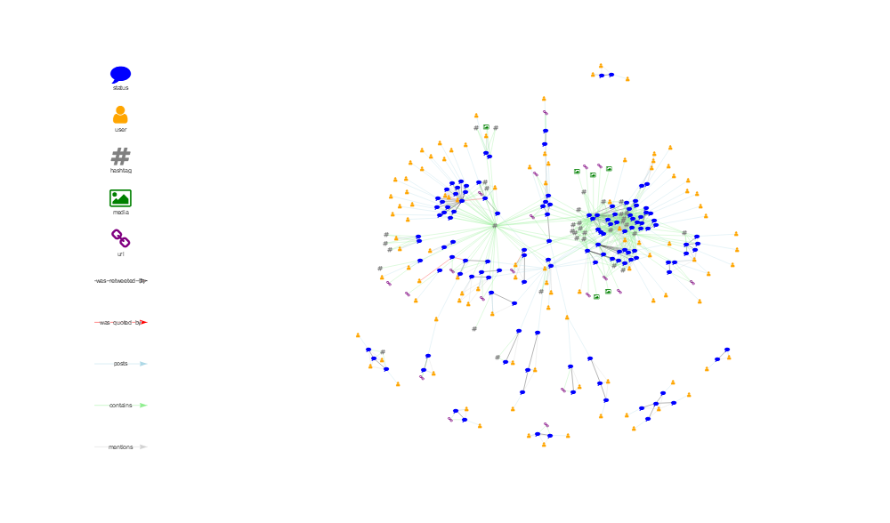

<!-- README.Rmd generates README.md. -->

# `{tweetgraph}`

<!-- badges: start -->

[](https://www.tidyverse.org/lifecycle/#experimental)
[](https://github.com/knapply/tweetgraph/commits/master)
[](https://codecov.io/gh/knapply/tweetgraph?branch=master)
[](https://ci.appveyor.com/project/knapply/tweetgraph)
[](https://travis-ci.org/knapply/tweetgraph)
[](https://www.gnu.org/licenses/gpl-3.0)
[](https://www.r-project.org/)
[](https://github.com/knapply/tweetgraph)
[](http://hits.dwyl.io/knapply/tweetgraph)
<!-- badges: end -->

# Installation

``` r
# install.packages("remotes")
remotes::install_github("knapply/tweetgraph")
```

# Usage

``` r
library(tweetgraph)

hashtag_rstats <- rtweet::search_tweets("#rstats")
```

## Knowledge Graph

``` r
kg <- as_knowledge_graph(hashtag_rstats)
kg
```

    #> IGRAPH 1c5a105 DN-- 271 917 -- 
    #> + attr: timestamp_ms (v/n), name (v/c), created_at (v/n), text
    #> | (v/c), source (v/c), lang (v/c), node_class (v/c), TWITTER_NAME
    #> | (v/c), screen_name (v/c), location (v/c), description (v/c), url
    #> | (v/c), protected (v/l), followers_count (v/n), friends_count
    #> | (v/n), listed_count (v/n), statuses_count (v/n),
    #> | favourites_count (v/n), account_created_at (v/n), verified
    #> | (v/l), profile_url (v/c), account_lang (v/l), time (e/n),
    #> | source_class (e/c), action (e/c), target_class (e/c)
    #> + edges from 1c5a105 (vertex names):
    #> [1] 1170761344846651402->1170802898818744321
    #> + ... omitted several edges

``` r
plot_vis_net(kg)
```



## Social Network

``` r
sn <- as_social_network(hashtag_rstats)
sn
```

    #> IGRAPH 1e7f021 DN-- 88 91 -- 
    #> + attr: name (v/c), timestamp_ms (v/n), TWITTER_NAME (v/c),
    #> | screen_name (v/c), location (v/c), description (v/c), url (v/c),
    #> | protected (v/l), followers_count (v/n), friends_count (v/n),
    #> | listed_count (v/n), statuses_count (v/n), favourites_count
    #> | (v/n), account_created_at (v/n), verified (v/l), profile_url
    #> | (v/c), account_lang (v/l), node_class (v/c), action (e/c),
    #> | status_id (e/c), text (e/c), source (e/c), lang (e/c)
    #> + edges from 1e7f021 (vertex names):
    #> [1] 703571724667908097->144592995  169859259         ->3230388598
    #> [3] 67024593          ->54482107   158380504         ->4263007693
    #> + ... omitted several edges

``` r
plot_vis_net(sn)
```


