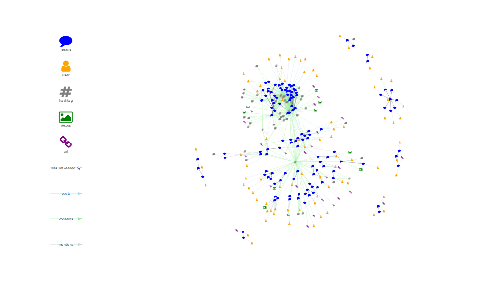

<!-- README.Rmd generates README.md. -->

# `{tweetgraph}`

<!-- badges: start -->

[](https://www.tidyverse.org/lifecycle/#experimental)
[](https://github.com/knapply/tweetgraph/commits/master)
[](https://codecov.io/gh/knapply/tweetgraph?branch=master)
[](https://ci.appveyor.com/project/knapply/tweetgraph)
[](https://travis-ci.org/knapply/tweetgraph)
[](https://www.gnu.org/licenses/gpl-3.0)
[](https://www.r-project.org/)
[](https://github.com/knapply/tweetgraph)
[](http://hits.dwyl.io/knapply/tweetgraph)
<!-- badges: end -->

# Installation

``` r
# install.packages("remotes")
remotes::install_github("knapply/tweetgraph")
```

# Usage

``` r
library(tweetgraph)

hashtag_rstats <- rtweet::search_tweets("#rstats")
```

## Knowledge Graph

### `as_knowledge_graph_primitive()`

``` r
kg_data <- as_knowledge_graph_primitive(hashtag_rstats)
kg_data$nodes %>% tibble::as_tibble()
```

    #> # A tibble: 306 x 22
    #>    name  timestamp_ms created_at text  source lang  node_class TWITTER_NAME
    #>    <chr>        <dbl>      <dbl> <chr> <chr>  <chr> <chr>      <chr>       
    #>  1 1173~  1568649504. 1568649448 "RVi~ R sta~ en    status     <NA>        
    #>  2 1173~  1568649504. 1568649422 "RVi~ R sta~ en    status     <NA>        
    #>  3 1173~  1568649504. 1568647794 "@vi~ R sta~ en    status     <NA>        
    #>  4 1173~  1568649504. 1568647775 "@RL~ R sta~ en    status     <NA>        
    #>  5 1173~  1568649504. 1568649386 "I w~ R sta~ en    status     <NA>        
    #>  6 1173~  1568649504. 1568649418 I go~ Twitt~ en    status     <NA>        
    #>  7 1173~  1568649504. 1568649407 "amo~ rstat~ en    status     <NA>        
    #>  8 1173~  1568649504. 1568649407 "whe~ rstat~ en    status     <NA>        
    #>  9 1173~  1568649504. 1568649408 "the~ rstat~ en    status     <NA>        
    #> 10 1173~  1568649504. 1568649406 "The~ rstat~ en    status     <NA>        
    #> # ... with 296 more rows, and 14 more variables: screen_name <chr>,
    #> #   location <chr>, description <chr>, url <chr>, protected <lgl>,
    #> #   followers_count <int>, friends_count <int>, listed_count <int>,
    #> #   statuses_count <int>, favourites_count <int>,
    #> #   account_created_at <dbl>, verified <lgl>, profile_url <chr>,
    #> #   account_lang <lgl>

``` r
kg_data$edges %>% tibble::as_tibble()
```

    #> # A tibble: 780 x 6
    #>    source        target           time source_class action     target_class
    #>    <chr>         <chr>           <dbl> <chr>        <chr>      <chr>       
    #>  1 117362296888~ 117362696767~  1.57e9 status       was_retwe~ status      
    #>  2 117362160717~ 117362685851~  1.57e9 status       was_retwe~ status      
    #>  3 117361885492~ 117362002836~  1.57e9 status       was_retwe~ status      
    #>  4 117361757457~ 117361994782~  1.57e9 status       was_retwe~ status      
    #>  5 117362079738~ 117362670659~  1.57e9 status       was_retwe~ status      
    #>  6 117362486884~ 117362679679~  1.57e9 status       was_retwe~ status      
    #>  7 117362468618~ 117362679561~  1.57e9 status       was_retwe~ status      
    #>  8 117362522338~ 117362679791~  1.57e9 status       was_retwe~ status      
    #>  9 117362379331~ 117362679205~  1.57e9 status       was_retwe~ status      
    #> 10 117362362091~ 117362679094~  1.57e9 status       was_retwe~ status      
    #> # ... with 770 more rows

### `as_knowledge_igraph()`

``` r
as_knowledge_igraph(hashtag_rstats)
```

    #> IGRAPH d07fe6c DN-- 306 780 -- 
    #> + attr: name (v/c), timestamp_ms (v/n), created_at (v/n), text
    #> | (v/c), source (v/c), lang (v/c), node_class (v/c), TWITTER_NAME
    #> | (v/c), screen_name (v/c), location (v/c), description (v/c), url
    #> | (v/c), protected (v/l), followers_count (v/n), friends_count
    #> | (v/n), listed_count (v/n), statuses_count (v/n),
    #> | favourites_count (v/n), account_created_at (v/n), verified
    #> | (v/l), profile_url (v/c), account_lang (v/l), time (e/n),
    #> | source_class (e/c), action (e/c), target_class (e/c)
    #> + edges from d07fe6c (vertex names):
    #> [1] 1173622968880177153->1173626967675084802
    #> + ... omitted several edges

``` r
as_knowledge_igraph(kg_data)
```

    #> IGRAPH d080f99 DN-- 306 780 -- 
    #> + attr: name (v/c), timestamp_ms (v/n), created_at (v/n), text
    #> | (v/c), source (v/c), lang (v/c), node_class (v/c), TWITTER_NAME
    #> | (v/c), screen_name (v/c), location (v/c), description (v/c), url
    #> | (v/c), protected (v/l), followers_count (v/n), friends_count
    #> | (v/n), listed_count (v/n), statuses_count (v/n),
    #> | favourites_count (v/n), account_created_at (v/n), verified
    #> | (v/l), profile_url (v/c), account_lang (v/l), time (e/n),
    #> | source_class (e/c), action (e/c), target_class (e/c)
    #> + edges from d080f99 (vertex names):
    #> [1] 1173622968880177153->1173626967675084802
    #> + ... omitted several edges

``` r
kg_data %>% 
  as_knowledge_igraph() %>% 
  plot_vis_net()
```


## Social Network Analysis

### `as_socnet_primitive()`

``` r
sna_data <- as_socnet_primitive(hashtag_rstats)
sna_data$nodes %>% tibble::as_tibble()
```

    #> # A tibble: 118 x 18
    #>    name  timestamp_ms TWITTER_NAME screen_name location description url  
    #>    <chr>        <dbl> <chr>        <chr>       <chr>    <chr>       <chr>
    #>  1 1075~  1568649508. R for Data ~ rstats4ds   ""       Interested~ <NA> 
    #>  2 1011~  1568649508. Rstats       rstatstweet ""       I retweet ~ <NA> 
    #>  3 1104~  1568649508. Ed. T        Simplify_Ed North R~ Health Ser~ http~
    #>  4 3832~  1568649508. "Marc Belzu~ marcbeldata Barcelo~ Data Scien~ <NA> 
    #>  5 1183~  1568649508. udaya dampa~ udayadampa~ ""       an academi~ <NA> 
    #>  6 8046~  1568649508. Brenda Caro~ CaritoTV    Puerto ~ "\U0001f1e~ http~
    #>  7 2972~  1568649508. Nicholas Pa~ nxparks     Harare,~ I am a Dig~ <NA> 
    #>  8 1172~  1568649508. Brett J. Ga~ brettjgall  ÜT: 38.~ PhD candid~ http~
    #>  9 8124~  1568649508. <U+2728>gopherbot<U+2728>~ botgopher   San Fra~ Intelligen~ <NA> 
    #> 10 2797~  1568649508. "\U0001f4a1~ wajdi_bs    Somewhe~ "Statistic~ http~
    #> # ... with 108 more rows, and 11 more variables: protected <lgl>,
    #> #   followers_count <int>, friends_count <int>, listed_count <int>,
    #> #   statuses_count <int>, favourites_count <int>,
    #> #   account_created_at <dbl>, verified <lgl>, profile_url <chr>,
    #> #   account_lang <lgl>, node_class <chr>

``` r
sna_data$edges %>% tibble::as_tibble()
```

    #> # A tibble: 352 x 7
    #>    from     to       action  status_id   text                source   lang 
    #>    <chr>    <chr>    <chr>   <chr>       <chr>               <chr>    <chr>
    #>  1 1075011~ 1270025~ mentio~ 1173626967~ "RViews reviews tw~ R stats~ en   
    #>  2 1075011~ 1270025~ retweet 1173626967~ "RViews reviews tw~ R stats~ en   
    #>  3 1075011~ 1269440~ mentio~ 1173626858~ "RViews reviews tw~ R stats~ en   
    #>  4 1075011~ 1269440~ retweet 1173626858~ "RViews reviews tw~ R stats~ en   
    #>  5 1075011~ 7658929~ mentio~ 1173620028~ "@vickdata I've ju~ R stats~ en   
    #>  6 1075011~ 7046803~ mentio~ 1173620028~ "@vickdata I've ju~ R stats~ en   
    #>  7 1075011~ 5712021~ mentio~ 1173620028~ "@vickdata I've ju~ R stats~ en   
    #>  8 1075011~ 7658929~ retweet 1173620028~ "@vickdata I've ju~ R stats~ en   
    #>  9 1075011~ 7658929~ retweet 1173620028~ "@vickdata I've ju~ R stats~ en   
    #> 10 1075011~ 7658929~ retweet 1173620028~ "@vickdata I've ju~ R stats~ en   
    #> # ... with 342 more rows

### `as_socnet_network()`

``` r
as_socnet_network(hashtag_rstats)
```

    #>  Network attributes:
    #>   vertices = 118 
    #>   directed = TRUE 
    #>   hyper = FALSE 
    #>   loops = TRUE 
    #>   multiple = TRUE 
    #>   bipartite = FALSE 
    #>   total edges= 352 
    #>     missing edges= 0 
    #>     non-missing edges= 352 
    #> 
    #>  Vertex attribute names: 
    #>     account_created_at account_lang description favourites_count followers_count friends_count listed_count location node_class profile_url protected screen_name statuses_count timestamp_ms TWITTER_NAME url verified vertex.names 
    #> 
    #>  Edge attribute names: 
    #>     action lang source status_id text

``` r
as_socnet_network(sna_data)
```

    #>  Network attributes:
    #>   vertices = 118 
    #>   directed = TRUE 
    #>   hyper = FALSE 
    #>   loops = TRUE 
    #>   multiple = TRUE 
    #>   bipartite = FALSE 
    #>   total edges= 352 
    #>     missing edges= 0 
    #>     non-missing edges= 352 
    #> 
    #>  Vertex attribute names: 
    #>     account_created_at account_lang description favourites_count followers_count friends_count listed_count location node_class profile_url protected screen_name statuses_count timestamp_ms TWITTER_NAME url verified vertex.names 
    #> 
    #>  Edge attribute names: 
    #>     action lang source status_id text

### `as_socnet_igraph()`

``` r
as_socnet_igraph(hashtag_rstats)
```

    #> IGRAPH d302885 DN-- 118 352 -- 
    #> + attr: name (v/c), timestamp_ms (v/n), TWITTER_NAME (v/c),
    #> | screen_name (v/c), location (v/c), description (v/c), url (v/c),
    #> | protected (v/l), followers_count (v/n), friends_count (v/n),
    #> | listed_count (v/n), statuses_count (v/n), favourites_count
    #> | (v/n), account_created_at (v/n), verified (v/l), profile_url
    #> | (v/c), account_lang (v/l), node_class (v/c), action (e/c),
    #> | status_id (e/c), text (e/c), source (e/c), lang (e/c)
    #> + edges from d302885 (vertex names):
    #> [1] 1075011651366199297->1270025862 1075011651366199297->1270025862
    #> [3] 1075011651366199297->1269440827 1075011651366199297->1269440827
    #> + ... omitted several edges

``` r
as_socnet_igraph(sna_data)
```

    #> IGRAPH d3032d0 DN-- 118 352 -- 
    #> + attr: name (v/c), timestamp_ms (v/n), TWITTER_NAME (v/c),
    #> | screen_name (v/c), location (v/c), description (v/c), url (v/c),
    #> | protected (v/l), followers_count (v/n), friends_count (v/n),
    #> | listed_count (v/n), statuses_count (v/n), favourites_count
    #> | (v/n), account_created_at (v/n), verified (v/l), profile_url
    #> | (v/c), account_lang (v/l), node_class (v/c), action (e/c),
    #> | status_id (e/c), text (e/c), source (e/c), lang (e/c)
    #> + edges from d3032d0 (vertex names):
    #> [1] 1075011651366199297->1270025862 1075011651366199297->1270025862
    #> [3] 1075011651366199297->1269440827 1075011651366199297->1269440827
    #> + ... omitted several edges

``` r
sna_data %>% 
  as_socnet_igraph() %>% 
  plot_vis_net()
```



<!-- # `R CMD Check` -->

<!-- ```{r} -->

<!-- devtools::check(quiet = TRUE) -->

<!-- ``` -->

# Cite

``` r
citation("tweetgraph")
```

    #> 
    #> To cite tweetgraph use:
    #> 
    #>   Knapp, B. G. (2019). tweetgraph: Tweet Graph Structures for
    #>   Network Analysis Data. R package version 0.0.0.9 Retrieved from
    #>   https://knapply.github.io/tweetgraph
    #> 
    #> A BibTeX entry for LaTeX users is
    #> 
    #>   @Manual{tweetgraph-package,
    #>     title = {tweetgraph: Tweet Graph Structures for Network Analysis},
    #>     author = {Brendan Knapp},
    #>     year = {2019},
    #>     note = {R package version 0.0.0.9},
    #>     url = {https://knapply.github.io/tweetgraph},
    #>   }
