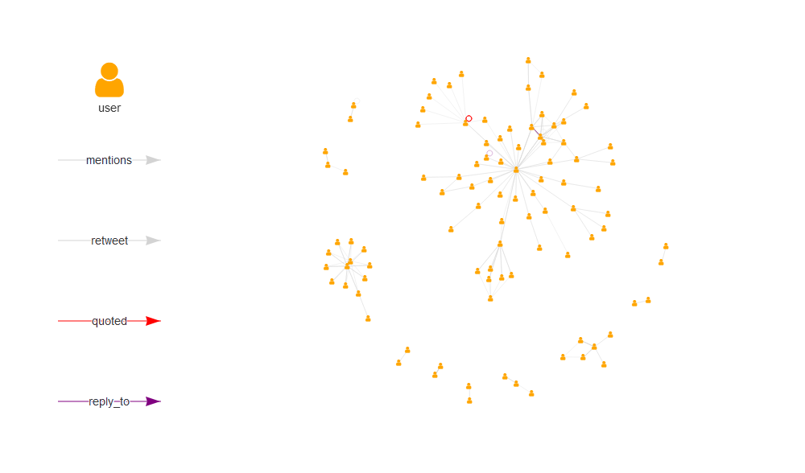

<!-- README.Rmd generates README.md. -->

# `{tweetgraph}`

<!-- badges: start -->

[](https://www.tidyverse.org/lifecycle/#experimental)
[](https://github.com/knapply/tweetgraph/commits/master)
[](https://codecov.io/gh/knapply/tweetgraph?branch=master)
[](https://ci.appveyor.com/project/knapply/tweetgraph)
[](https://travis-ci.org/knapply/tweetgraph)
[](https://www.gnu.org/licenses/gpl-3.0)
[](https://www.r-project.org/)
[](https://github.com/knapply/tweetgraph)
[](http://hits.dwyl.io/knapply/tweetgraph)
<!-- badges: end -->

# Installation

``` r
# install.packages("remotes")
remotes::install_github("knapply/tweetgraph")
```

# Usage

``` r
library(tweetgraph)

library(rtweet)
hashtag_rstats <- search_tweets("#rstats")
```

## Knowledge Graph

``` r
kg <- as_knowledge_graph(hashtag_rstats)
kg
```

    #> IGRAPH fc54bbe DN-- 297 720 -- 
    #> + attr: timestamp_ms (v/n), name (v/c), created_at (v/n), text
    #> | (v/c), source (v/c), lang (v/c), node_class (v/c), TWITTER_NAME
    #> | (v/c), screen_name (v/c), location (v/c), description (v/c), url
    #> | (v/c), protected (v/l), followers_count (v/n), friends_count
    #> | (v/n), listed_count (v/n), statuses_count (v/n),
    #> | favourites_count (v/n), account_created_at (v/n), verified
    #> | (v/l), profile_url (v/c), account_lang (v/l), time (e/n),
    #> | source_class (e/c), action (e/c), target_class (e/c)
    #> + edges from fc54bbe (vertex names):
    #> [1] 1171416619207278600->1171427757969903618
    #> + ... omitted several edges

``` r
plot_vis_net(kg)
```


## Social Network

``` r
sn <- as_social_network(hashtag_rstats)
sn
```

    #> IGRAPH fe67af5 DN-- 98 275 -- 
    #> + attr: name (v/c), timestamp_ms (v/n), TWITTER_NAME (v/c),
    #> | screen_name (v/c), location (v/c), description (v/c), url (v/c),
    #> | protected (v/l), followers_count (v/n), friends_count (v/n),
    #> | listed_count (v/n), statuses_count (v/n), favourites_count
    #> | (v/n), account_created_at (v/n), verified (v/l), profile_url
    #> | (v/c), account_lang (v/l), node_class (v/c), action (e/c),
    #> | status_id (e/c), text (e/c), source (e/c), lang (e/c)
    #> + edges from fe67af5 (vertex names):
    #> [1] 14778204           ->273781698         
    #> [2] 14778204           ->273781698         
    #> + ... omitted several edges

``` r
plot_vis_net(sn)
```



# So What?

``` r
data.table::data.table(
  var = c("as_knowledge_graph", "as_social_network"),
  
  n_nodes = vapply(list(kg, sn), igraph::vcount, numeric(1L)),
  n_edges = vapply(list(kg, sn), igraph::ecount, numeric(1L)),
  
  node_types = lapply(list(kg, sn), function(x) unique(igraph::V(x)$node_class)),
  node_attrs = lapply(list(kg, sn),igraph::vertex_attr_names),
  
  edge_attrs = lapply(list(kg, sn),igraph::edge_attr_names),
  edge_types = lapply(list(kg, sn), function(x) unique(igraph::E(x)$action))
  ) %>% 
  knitr::kable(format = "markdown", escape = FALSE)
```

| var                  | n\_nodes | n\_edges | node\_types                                    | node\_attrs                                                                                                                                                                                                                                                                                                                            | edge\_attrs                                           | edge\_types                                                                                         |
| :------------------- | -------: | -------: | :--------------------------------------------- | :------------------------------------------------------------------------------------------------------------------------------------------------------------------------------------------------------------------------------------------------------------------------------------------------------------------------------------- | :---------------------------------------------------- | :-------------------------------------------------------------------------------------------------- |
| as\_knowledge\_graph |      297 |      720 | c(“status”, “user”, “hashtag”, “media”, “url”) | c(“timestamp\_ms”, “name”, “created\_at”, “text”, “source”, “lang”, “node\_class”, “TWITTER\_NAME”, “screen\_name”, “location”, “description”, “url”, “protected”, “followers\_count”, “friends\_count”, “listed\_count”, “statuses\_count”, “favourites\_count”, “account\_created\_at”, “verified”, “profile\_url”, “account\_lang”) | c(“time”, “source\_class”, “action”, “target\_class”) | c(“was\_retweeted\_by”, “was\_replied\_to\_by”, “was\_quoted\_by”, “posts”, “contains”, “mentions”) |
| as\_social\_network  |       98 |      275 | user                                           | c(“name”, “timestamp\_ms”, “TWITTER\_NAME”, “screen\_name”, “location”, “description”, “url”, “protected”, “followers\_count”, “friends\_count”, “listed\_count”, “statuses\_count”, “favourites\_count”, “account\_created\_at”, “verified”, “profile\_url”, “account\_lang”, “node\_class”)                                          | c(“action”, “status\_id”, “text”, “source”, “lang”)   | c(“mentions”, “retweet”, “quoted”, “reply\_to”)                                                     |
