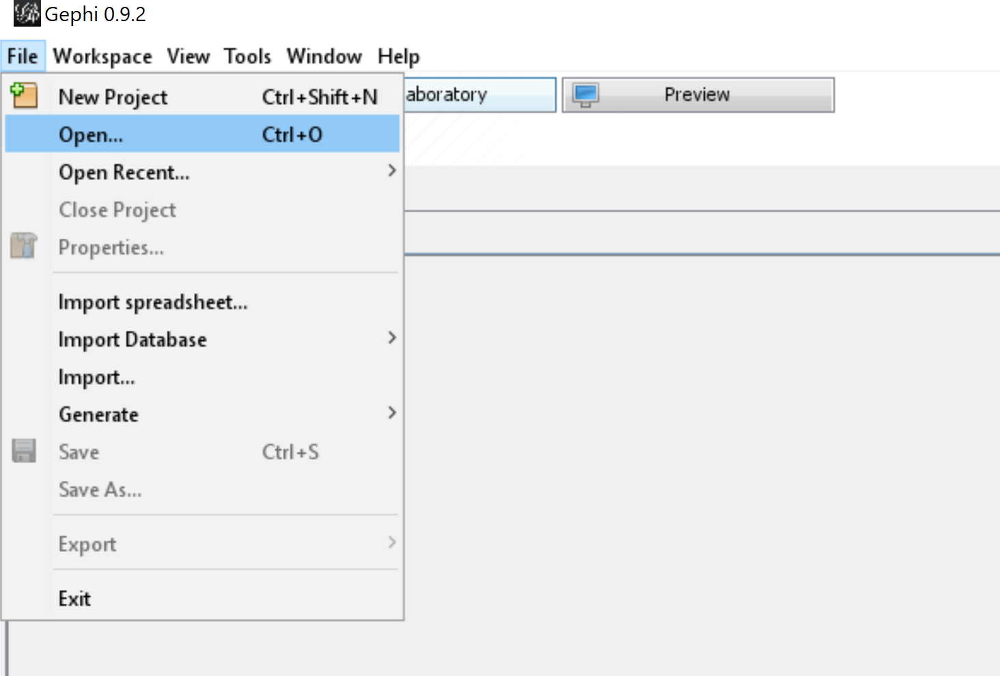
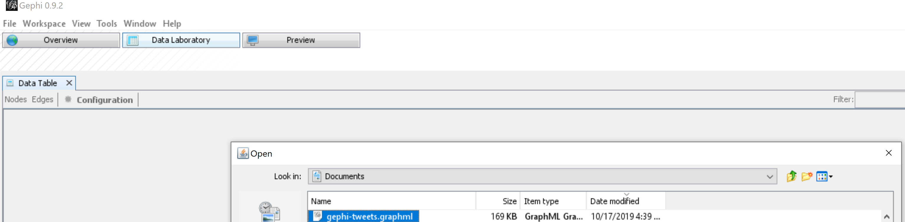
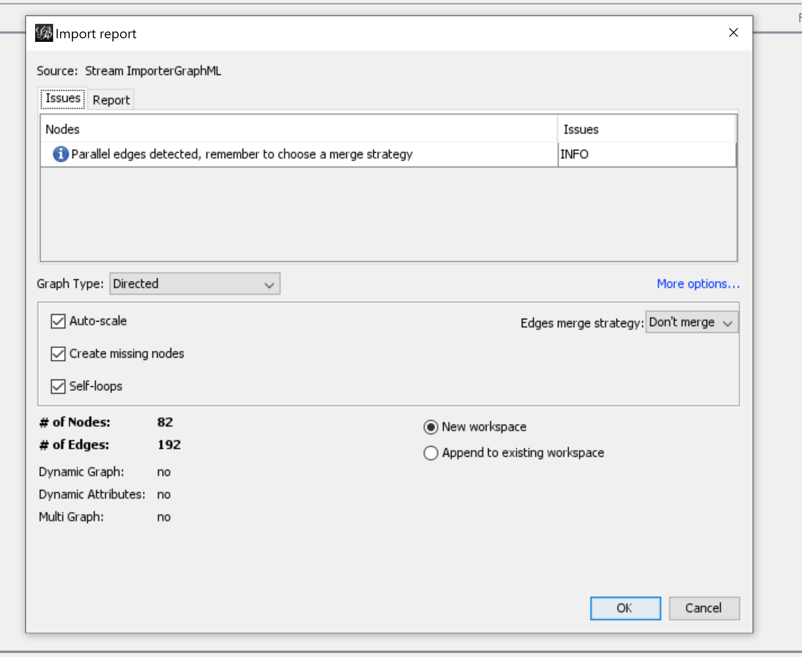
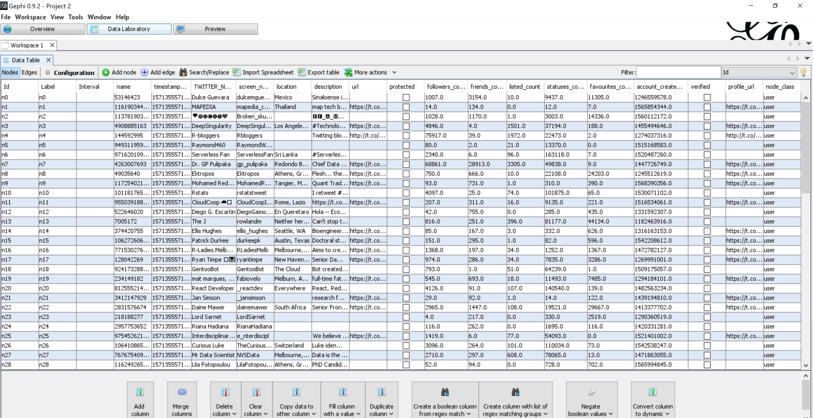
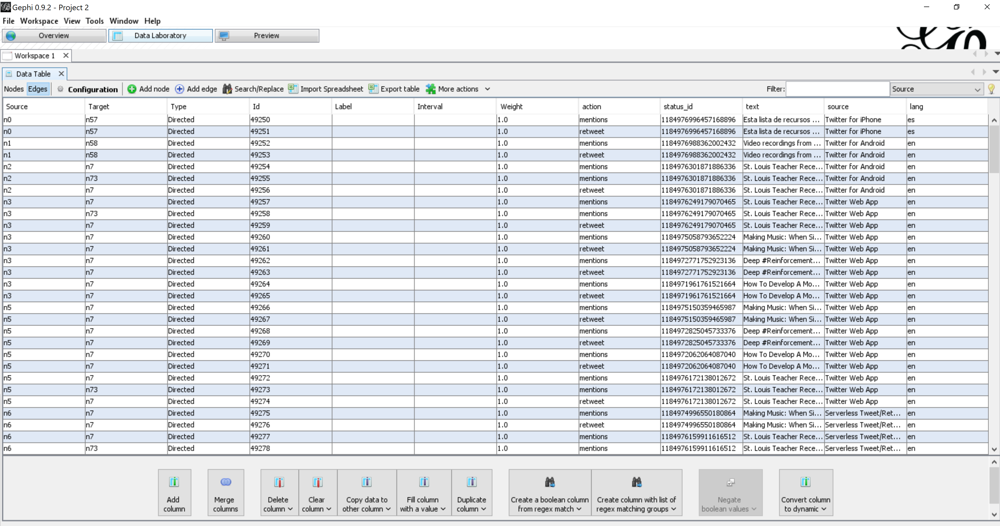
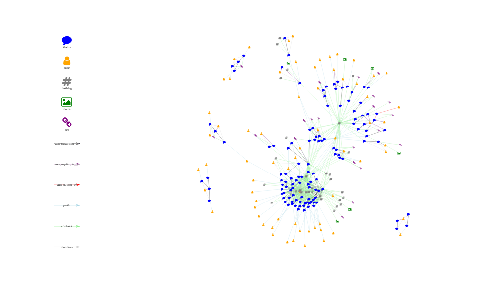

<!-- README.Rmd generates README.md. -->

# `{tweetgraph}`

<!-- badges: start -->

[](https://www.tidyverse.org/lifecycle/#experimental)
[](https://github.com/knapply/tweetgraph/commits/master)
[](https://codecov.io/gh/knapply/tweetgraph?branch=master)
[](https://ci.appveyor.com/project/knapply/tweetgraph)
[](https://travis-ci.org/knapply/tweetgraph)
[](https://www.gnu.org/licenses/gpl-3.0)
[](https://www.r-project.org/)
[](https://github.com/knapply/tweetgraph)
[](http://hits.dwyl.io/knapply/tweetgraph)
<!-- badges: end -->

# Installation

``` r
# install.packages("remotes")
remotes::install_github("knapply/tweetgraph")
```

# Usage

``` r
library(tweetgraph)

hashtag_rstats <- rtweet::search_tweets("#rstats")
```

## Social Network Analysis

### `as_sna_primitive()`

``` r
sna_data <- as_sna_primitive(hashtag_rstats)

lapply(sna_data, names)
```

    #> $edges
    #> [1] "from"      "to"        "action"    "status_id" "text"      "source"   
    #> [7] "lang"     
    #> 
    #> $nodes
    #>  [1] "name"               "timestamp_ms"       "TWITTER_NAME"      
    #>  [4] "screen_name"        "location"           "description"       
    #>  [7] "url"                "protected"          "followers_count"   
    #> [10] "friends_count"      "listed_count"       "statuses_count"    
    #> [13] "favourites_count"   "account_created_at" "verified"          
    #> [16] "profile_url"        "account_lang"       "node_class"

### Using `{igraph}`

``` r
as_sna_igraph(hashtag_rstats)
```

    #> IGRAPH 6fdbb99 DN-- 68 176 -- 
    #> + attr: name (v/c), timestamp_ms (v/n), TWITTER_NAME (v/c),
    #> | screen_name (v/c), location (v/c), description (v/c), url (v/c),
    #> | protected (v/l), followers_count (v/n), friends_count (v/n),
    #> | listed_count (v/n), statuses_count (v/n), favourites_count
    #> | (v/n), account_created_at (v/n), verified (v/l), profile_url
    #> | (v/c), account_lang (v/l), node_class (v/c), action (e/c),
    #> | status_id (e/c), text (e/c), source (e/c), lang (e/c)
    #> + edges from 6fdbb99 (vertex names):
    #> [1] 1075011651366199297->144592995 1075011651366199297->144592995
    #> [3] 1075011651366199297->144592995 1075011651366199297->144592995
    #> + ... omitted several edges

``` r
as_sna_igraph(sna_data)
```

    #> IGRAPH 6fdca54 DN-- 68 176 -- 
    #> + attr: name (v/c), timestamp_ms (v/n), TWITTER_NAME (v/c),
    #> | screen_name (v/c), location (v/c), description (v/c), url (v/c),
    #> | protected (v/l), followers_count (v/n), friends_count (v/n),
    #> | listed_count (v/n), statuses_count (v/n), favourites_count
    #> | (v/n), account_created_at (v/n), verified (v/l), profile_url
    #> | (v/c), account_lang (v/l), node_class (v/c), action (e/c),
    #> | status_id (e/c), text (e/c), source (e/c), lang (e/c)
    #> + edges from 6fdca54 (vertex names):
    #> [1] 1075011651366199297->144592995 1075011651366199297->144592995
    #> [3] 1075011651366199297->144592995 1075011651366199297->144592995
    #> + ... omitted several edges

``` r
sna_data %>% 
  as_sna_igraph() %>% 
  plot_vis_net()
```


### Using `{network}`

``` r
as_sna_network(hashtag_rstats)
```

    #>  Network attributes:
    #>   vertices = 68 
    #>   directed = TRUE 
    #>   hyper = FALSE 
    #>   loops = TRUE 
    #>   multiple = TRUE 
    #>   bipartite = FALSE 
    #>   total edges= 176 
    #>     missing edges= 0 
    #>     non-missing edges= 176 
    #> 
    #>  Vertex attribute names: 
    #>     account_created_at account_lang description favourites_count followers_count friends_count listed_count location node_class profile_url protected screen_name statuses_count timestamp_ms TWITTER_NAME url verified vertex.names 
    #> 
    #>  Edge attribute names: 
    #>     action lang source status_id text

``` r
as_sna_network(sna_data)
```

    #>  Network attributes:
    #>   vertices = 68 
    #>   directed = TRUE 
    #>   hyper = FALSE 
    #>   loops = TRUE 
    #>   multiple = TRUE 
    #>   bipartite = FALSE 
    #>   total edges= 176 
    #>     missing edges= 0 
    #>     non-missing edges= 176 
    #> 
    #>  Vertex attribute names: 
    #>     account_created_at account_lang description favourites_count followers_count friends_count listed_count location node_class profile_url protected screen_name statuses_count timestamp_ms TWITTER_NAME url verified vertex.names 
    #> 
    #>  Edge attribute names: 
    #>     action lang source status_id text

## Write Gephi-Friendly .graphml Files

``` r
target_file_path <- "~/gephi-tweets.graphml"

tweet_graph <- as_sna_igraph(hashtag_rstats)

write_graphml(g = tweet_graph, path = target_file_path)
```

### Opening with Gephi

1.  


<br><br>

2.  


<br><br>

3.  


<br><br>

4.  




## Knowledge Graph

### `as_kg_primitive()`

``` r
kg_data <- as_kg_primitive(hashtag_rstats)

lapply(kg_data, names)
```

    #> $edges
    #> [1] "source"       "target"       "time"         "source_class"
    #> [5] "action"       "target_class"
    #> 
    #> $nodes
    #>  [1] "name"               "timestamp_ms"       "created_at"        
    #>  [4] "text"               "source"             "lang"              
    #>  [7] "node_class"         "TWITTER_NAME"       "screen_name"       
    #> [10] "location"           "description"        "url"               
    #> [13] "protected"          "followers_count"    "friends_count"     
    #> [16] "listed_count"       "statuses_count"     "favourites_count"  
    #> [19] "account_created_at" "verified"           "profile_url"       
    #> [22] "account_lang"

### Using `{igraph}`

``` r
as_kg_igraph(hashtag_rstats)
```

    #> IGRAPH 720affa DN-- 247 851 -- 
    #> + attr: name (v/c), timestamp_ms (v/n), created_at (v/n), text
    #> | (v/c), source (v/c), lang (v/c), node_class (v/c), TWITTER_NAME
    #> | (v/c), screen_name (v/c), location (v/c), description (v/c), url
    #> | (v/c), protected (v/l), followers_count (v/n), friends_count
    #> | (v/n), listed_count (v/n), statuses_count (v/n),
    #> | favourites_count (v/n), account_created_at (v/n), verified
    #> | (v/l), profile_url (v/c), account_lang (v/l), time (e/n),
    #> | source_class (e/c), action (e/c), target_class (e/c)
    #> + edges from 720affa (vertex names):
    #> [1] 1184982560247631873->1184989314238894080
    #> + ... omitted several edges

``` r
as_kg_igraph(kg_data)
```

    #> IGRAPH 720b74e DN-- 247 851 -- 
    #> + attr: name (v/c), timestamp_ms (v/n), created_at (v/n), text
    #> | (v/c), source (v/c), lang (v/c), node_class (v/c), TWITTER_NAME
    #> | (v/c), screen_name (v/c), location (v/c), description (v/c), url
    #> | (v/c), protected (v/l), followers_count (v/n), friends_count
    #> | (v/n), listed_count (v/n), statuses_count (v/n),
    #> | favourites_count (v/n), account_created_at (v/n), verified
    #> | (v/l), profile_url (v/c), account_lang (v/l), time (e/n),
    #> | source_class (e/c), action (e/c), target_class (e/c)
    #> + edges from 720b74e (vertex names):
    #> [1] 1184982560247631873->1184989314238894080
    #> + ... omitted several edges

``` r
kg_data %>% 
  as_kg_igraph() %>% 
  plot_vis_net()
```



### Using `{network}`

``` r
as_kg_network(hashtag_rstats)
```

    #>  Network attributes:
    #>   vertices = 247 
    #>   directed = TRUE 
    #>   hyper = FALSE 
    #>   loops = TRUE 
    #>   multiple = FALSE 
    #>   bipartite = FALSE 
    #>   total edges= 851 
    #>     missing edges= 0 
    #>     non-missing edges= 851 
    #> 
    #>  Vertex attribute names: 
    #>     account_created_at account_lang created_at description favourites_count followers_count friends_count lang listed_count location node_class profile_url protected screen_name source statuses_count text timestamp_ms TWITTER_NAME url verified vertex.names 
    #> 
    #>  Edge attribute names: 
    #>     action source source_class target_class time

``` r
as_kg_network(kg_data)
```

    #>  Network attributes:
    #>   vertices = 247 
    #>   directed = TRUE 
    #>   hyper = FALSE 
    #>   loops = TRUE 
    #>   multiple = FALSE 
    #>   bipartite = FALSE 
    #>   total edges= 851 
    #>     missing edges= 0 
    #>     non-missing edges= 851 
    #> 
    #>  Vertex attribute names: 
    #>     account_created_at account_lang created_at description favourites_count followers_count friends_count lang listed_count location node_class profile_url protected screen_name source statuses_count text timestamp_ms TWITTER_NAME url verified vertex.names 
    #> 
    #>  Edge attribute names: 
    #>     action source source_class target_class time
