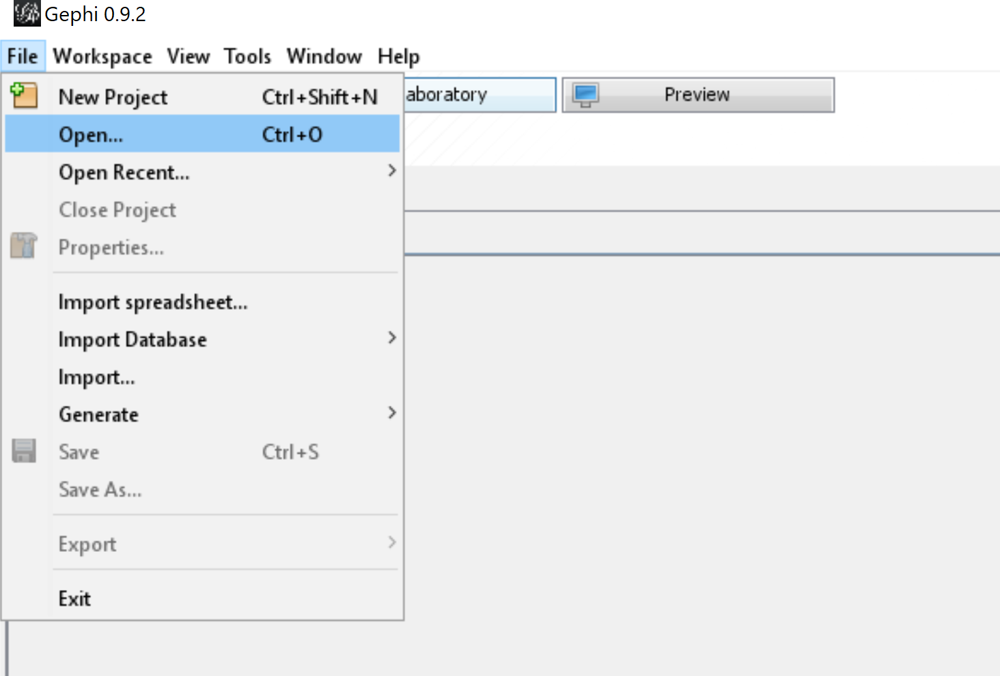
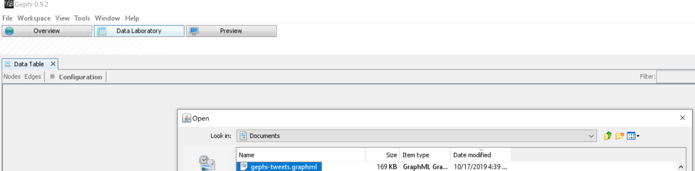
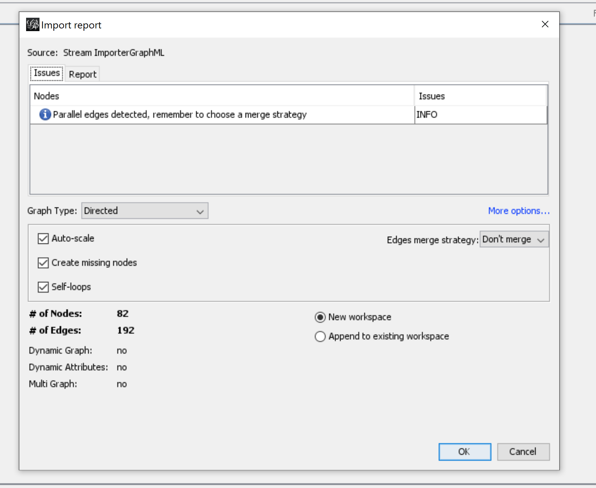
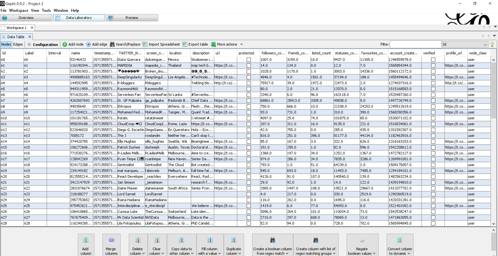
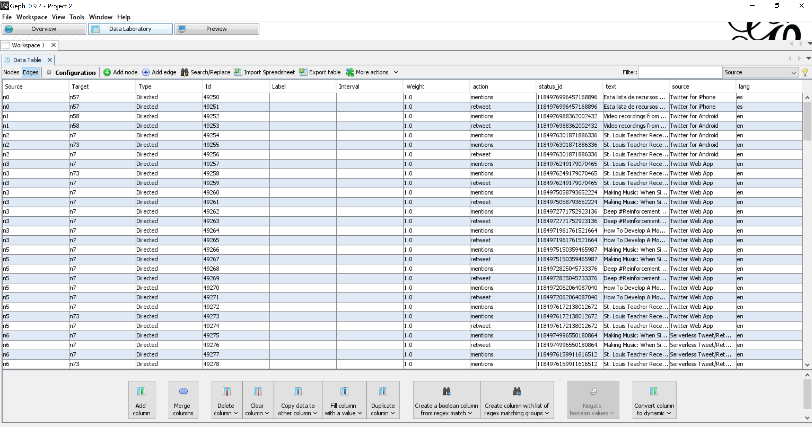

---
output:
  github_document:
    html_preview: true
  html_document:
    keep_md: yes
always_allow_html: yes
editor_options: 
  chunk_output_type: console
---

<!-- README.Rmd generates README.md. -->

```{r, echo = FALSE}
knitr::opts_chunk$set(
  # collapse = TRUE,
  fig.align = "center",
  comment = "#>",
  fig.path = "man/figures/",
  message = FALSE,
  warning = FALSE
)

# options(width = 400)
```


# `{tweetgraph}`

<!-- badges: start -->
[](https://www.tidyverse.org/lifecycle/#experimental)
[](https://github.com/knapply/tweetgraph/commits/master)
[](https://codecov.io/gh/knapply/tweetgraph?branch=master)
[](https://ci.appveyor.com/project/knapply/tweetgraph)
[](https://travis-ci.org/knapply/tweetgraph)
[](https://www.gnu.org/licenses/gpl-3.0)
[](https://www.r-project.org/)
[](https://github.com/knapply/tweetgraph)
[](http://hits.dwyl.io/knapply/tweetgraph)
<!-- badges: end -->


# Installation

```{r, eval=FALSE}
# install.packages("remotes")
remotes::install_github("knapply/tweetgraph")
```

# Usage

```{r}
library(tweetgraph)

hashtag_rstats <- rtweet::search_tweets("#rstats")
```


## Social Network Analysis

### `as_sna_primitive()`

```{r}
sna_data <- as_sna_primitive(hashtag_rstats)

lapply(sna_data, names)
```

### Using `{igraph}`

```{r}
as_sna_igraph(hashtag_rstats)
as_sna_igraph(sna_data)
```

```{r}
sna_data %>% 
  as_sna_igraph() %>% 
  plot_vis_net()
```

### Using `{network}`

```{r}
as_sna_network(hashtag_rstats)
as_sna_network(sna_data)
```

## Write Gephi-Friendly .graphml Files


```{r}
target_file_path <- "~/gephi-tweets.graphml"

tweet_graph <- as_sna_igraph(hashtag_rstats)

write_graphml(g = tweet_graph, path = target_file_path)
```

### Opening with Gephi

1.

```{r, echo=FALSE}

```

<br><br>

2.

```{r, echo=FALSE}

```

<br><br>

3.

```{r, echo=FALSE}

```

<br><br>

4.

```{r, echo=FALSE}

```


```{r, echo=FALSE}

```


## Knowledge Graph

### `as_kg_primitive()`

```{r}
kg_data <- as_kg_primitive(hashtag_rstats)

lapply(kg_data, names)
```

### Using `{igraph}`

```{r}
as_kg_igraph(hashtag_rstats)
as_kg_igraph(kg_data)
```

```{r}
kg_data %>% 
  as_kg_igraph() %>% 
  plot_vis_net()
```

### Using `{network}`

```{r}
as_kg_network(hashtag_rstats)
as_kg_network(kg_data)
```